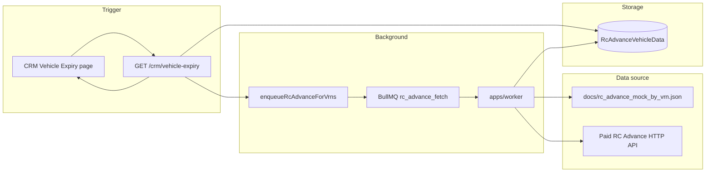

# RC Advance API + CRM Vehicle Expiry

How RC Advance owner/vehicle data is fetched, stored, and shown on **CRM > Vehicle Expiry** — and how to switch from mock testing to a paid API later.

## Overview

| Layer       | Role                                                    |
| ----------- | ------------------------------------------------------- |
| **Trigger** | Active CRM expiry queue (`GET /crm/vehicle-expiry`)     |
| **Queue**   | BullMQ job `rc_advance_fetch` on scrape queue           |
| **Worker**  | Calls `@vahanplus/rc-advance-client` → upserts Postgres |
| **Storage** | `processed."RcAdvanceVehicleData"`                      |
| **UI**      | CRM table columns from `flat` JSON (~100+ fields)       |

Portal expiry data (`EpassVehicleStatusRow`) and RC Advance data are **separate**. CRM merges both on the API response.



## When is RC Advance called?

RC Advance fetch runs only for vehicles in the **active** CRM queue when:

1. **Auto:** insurance **or** RC tax **or** fitness days-left ≤ filter threshold (default **30 days**), and not dismissed from CRM.
2. **Manual:** operator added the vehicle to CRM manually.

On each CRM list request, the API enqueues fetch jobs for VRNs that are **missing** data or **older than 7 days** (`RC_ADVANCE_FETCH_TTL_MS` in `@vahanplus/rc-advance-client`).

The HTTP response returns immediately with whatever is already in DB; new data appears after the worker completes (refresh the page).

## Where is data stored?

**Postgres table:** `processed."RcAdvanceVehicleData"`

| Column         | Purpose                                                                             |
| -------------- | ----------------------------------------------------------------------------------- |
| `vehicleRegNo` | Unique key (normalized plate)                                                       |
| `rawResponse`  | Full API JSON (same shape as `docs/rc_advance_api_sample.json`)                     |
| `result`       | `response.result` object only                                                       |
| `flat`         | Pre-flattened fields for CRM columns (`owner_name`, `insurance_*`, `financer_*`, …) |
| `source`       | `mock` or `http`                                                                    |
| `fetchedAt`    | Last successful/failed fetch time                                                   |
| `error`        | Error message when fetch failed                                                     |

CRM reads **`flat`** only — not the mock file and not the live API on every page load.

## Mock mode (current default)

### Files

| File                               | Purpose                                                                                                                        |
| ---------------------------------- | ------------------------------------------------------------------------------------------------------------------------------ |
| `docs/rc_advance_api_sample.json`  | Canonical response shape (from RC Advance API spec / xlsx)                                                                     |
| `docs/rc_advance_mock_by_vrn.json` | Generated map `{ "BR26GA3634": { ...full response... }, ... }` keyed by VRN from `docs/khanan_sample_5000.json` (4,854 plates) |

Regenerate mock data after changing the sample or Khanan fixture:

```bash
node scripts/generate-rc-advance-mock.mjs
```

Optional custom output:

```bash
node scripts/generate-rc-advance-mock.mjs --out /path/to/mock.json
```

### Environment (mock)

```env
RC_ADVANCE_PROVIDER=mock
# optional override:
# RC_ADVANCE_MOCK_FILE=docs/rc_advance_mock_by_vrn.json
```

Mock lookup: `packages/rc-advance-client/src/mockProvider.js` reads the JSON file once and caches in memory.

## Switching to the real paid API

When the vendor API returns the **same JSON shape** as `docs/rc_advance_api_sample.json`, only configuration and possibly `httpProvider.js` need changes — **not** CRM UI, DB schema, or worker job type.

### Step 1 — Set environment

On **worker** and **api-express** (enqueue only needs Redis; fetch runs in worker):

```env
RC_ADVANCE_PROVIDER=http
RC_ADVANCE_API_URL=https://vendor.example.com/rc-advance
RC_ADVANCE_API_KEY=your-secret-key
```

### Step 2 — Verify HTTP client matches vendor contract

Current stub: `packages/rc-advance-client/src/httpProvider.js`

- **Method:** GET
- **Query param:** `reg_no=<vehicleRegNo>`
- **Auth:** `Authorization: Bearer <RC_ADVANCE_API_KEY>` (if key set)
- **Body:** none — expects JSON body matching sample shape

If the vendor differs (POST body, different param name, API key header name), update **only** `httpProvider.js`. Keep the return shape:

```js
{ success: true, data: <full response object>, error: null }
// or
{ success: false, data: null, error: 'message' }
```

`persistRcAdvanceFetch()` in `packages/rc-advance-client/src/persist.js` handles DB upsert for both mock and HTTP.

### Step 3 — Deploy and validate

1. Restart worker with new env.
2. Open CRM Vehicle Expiry for a qualifying VRN.
3. Confirm worker logs job completion and DB row has `source = 'http'`.

```sql
SELECT "vehicleRegNo", source, message, "fetchedAt", error
FROM processed."RcAdvanceVehicleData"
ORDER BY "fetchedAt" DESC
LIMIT 20;
```

### Step 4 — New response fields (optional)

If the paid API adds fields not in the sample:

1. Update `docs/rc_advance_api_sample.json` (reference).
2. Adjust flatten rules in `packages/rc-advance-client/src/schema.js` and labels in `columns.js` if needed.
3. Rebuild columns cache runs at package load via `columnsData.js`.
4. CRM table picks up new columns automatically via `RC_ADVANCE_CRM_COLUMNS`.

No migration needed for new JSON keys inside `flat` / `rawResponse`.

## Key code locations

| Path                                                   | Purpose                                       |
| ------------------------------------------------------ | --------------------------------------------- |
| `packages/rc-advance-client/`                          | Mock/HTTP providers, flatten, CRM column list |
| `apps/api-express/src/services/rcAdvanceEnrichment.js` | Enqueue + DB read for CRM                     |
| `apps/api-express/src/routes/crmVehicleExpiry.js`      | Triggers enqueue on GET                       |
| `apps/worker/src/rcAdvanceFetch.js`                    | Worker handler                                |
| `apps/worker/src/index.js`                             | Job type `rc_advance_fetch`                   |
| `apps/web/src/components/crm/CrmExpiryTable.tsx`       | All RC Advance columns                        |
| `scripts/generate-rc-advance-mock.mjs`                 | Regenerate mock JSON                          |
| `scripts/seed-rc-advance-mock-to-db.mjs`               | Bulk load mock into Postgres                  |

## Testing this implementation

### Prerequisites

- Postgres + Redis running (`pnpm docker:up` or VPS stack)
- `.env` at repo root (or `deploy/env/hostinger.env`) with `DATABASE_URL`
- `pnpm bootstrap` (or at least contracts + rc-advance-client + db generate)

### Apply migration

**Local dev** (Postgres user can create databases):

```bash
pnpm db:migrate
```

**VPS / managed Postgres** (remote DB, no `CREATE DATABASE` permission — shadow DB fails with P3014):

```bash
pnpm db:deploy
```

Do **not** use `pnpm db:migrate` on production; it needs a Prisma shadow database.

### Option A — Fast path (mock data in DB, no worker wait)

```bash
pnpm db:deploy          # if table not created yet
pnpm seed:rc-advance-mock   # loads .env automatically; ~4,854 rows, few minutes
```

If apps are **already running** on the VPS (ports 3000/3001/8080 in use), skip `pnpm dev` — open the existing site and go to **CRM > Vehicle Expiry**.

Otherwise:

```bash
pnpm dev
```

### Option B — Full async path (worker + queue)

Only start `pnpm dev` if nothing is listening on 3000, 3001, 8080 (`EADDRINUSE` means stack is already up). 2. Ensure vehicle status exists for some plates (portal scrape or backfill):

```bash
pnpm --filter @vahanplus/worker backfill:vehicle-status --limit 100
```

3. Open **CRM > Vehicle Expiry** (default 30-day insurance/RC/fitness filters).
4. Worker processes `rc_advance_fetch` jobs → DB fills over a few seconds.
5. Refresh CRM page — RC columns populate.

Verify queue / DB:

```sql
-- CRM queue depends on portal expiry rows
SELECT COUNT(*) FROM processed."EpassVehicleStatusRow";

-- RC Advance storage
SELECT COUNT(*) FROM processed."RcAdvanceVehicleData";

SELECT "vehicleRegNo", source, "owner_name"-like check via flat
FROM processed."RcAdvanceVehicleData"
WHERE flat IS NOT NULL
LIMIT 5;
```

Example flat check:

```sql
SELECT "vehicleRegNo", flat->>'owner_name' AS owner, flat->>'mobile_no' AS mobile
FROM processed."RcAdvanceVehicleData"
WHERE flat IS NOT NULL
LIMIT 10;
```

### Option C — Unit tests

```bash
pnpm --filter @vahanplus/rc-advance-client test
pnpm --filter @vahanplus/api-express test -- __tests__/crmVehicleExpiry.test.js
```

### End-to-end with Khanan sample (realistic)

1. Import `docs/khanan_sample_5000.json` via **Khanan > Import**.
2. Backfill vehicle status for imported VRNs.
3. Seed or wait for RC Advance fetch.
4. CRM queue shows vehicles near expiry; RC columns show owner/mobile/insurance from mock.

See also: [khanan-bulk-json.md](./khanan-bulk-json.md).

## Troubleshooting

| Symptom                                     | Check                                                                                                |
| ------------------------------------------- | ---------------------------------------------------------------------------------------------------- |
| `P3014` shadow database / permission denied | Use `pnpm db:deploy` instead of `db:migrate` on VPS                                                  |
| `DATABASE_URL` not found on seed            | Use `pnpm seed:rc-advance-mock` (loads `.env`); ensure `.env` exists                                 |
| `EADDRINUSE` 3000 / 3001 / 8080             | Apps already running — do not run `pnpm dev` again; use live site or stop old processes first        |
| RC columns all `—`                          | `RcAdvanceVehicleData` empty → run `pnpm seed:rc-advance-mock` or ensure worker is running           |
| Jobs not processing                         | Redis up, worker logs, `rc_advance_fetch` on scrape queue                                            |
| Stale data                                  | TTL is 7 days; delete row or wait for refetch                                                        |
| Mock VRN not found                          | VRN must exist in `docs/rc_advance_mock_by_vrn.json`; regenerate with `generate-rc-advance-mock.mjs` |
| HTTP mode fails                             | `RC_ADVANCE_API_URL`, network from worker, response shape vs sample                                  |

## Related

- CRM expiry queue logic: `apps/api-express/src/services/crmVehicleExpiryQueue.js`
- Portal vehicle status pipeline: [bihar-epass-pipeline.md](../scraping/bihar-epass-pipeline.md)
- API response reference: `docs/rc_advance_api_sample.json`, `docs/API Jason file Name.xlsx`
