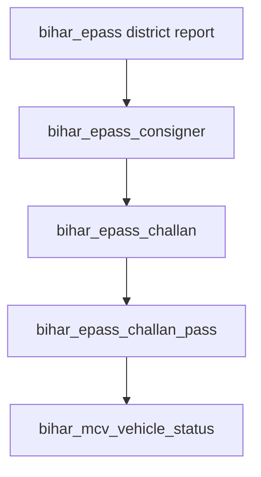

# Bihar KhananSoft ePass scraping pipeline

End-to-end reference for levels 1–4 of the Bihar ePass ingest pipeline: district snapshot → consigner → challan → challan pass → MCV vehicle status.

## Pipeline levels



| Level | Job type                   | Portal                         | DB tables                           |
| ----- | -------------------------- | ------------------------------ | ----------------------------------- |
| 1     | `bihar_epass`              | `epassreportAllDist.aspx`      | `EpassSnapshot`, `EpassDistrictRow` |
| 2     | `bihar_epass_consigner`    | Lessee/dealer pass detail URLs | `EpassConsignerRow`                 |
| 3     | `bihar_epass_challan`      | Consigner challan detail       | `EpassChallanRow`                   |
| 4     | `bihar_epass_challan_pass` | Challan pass detail            | `EpassChallanPassRow`               |
| 5     | `bihar_mcv_vehicle_status` | `MCVReportWiseStatus.aspx`     | `EpassVehicleStatusRow`             |

## Queue and throttle (balanced profile)


Throttle is **not** stacked:

- **Removed:** per-job `delay: index * 2000` on fanout (was serializing enqueue).
- **Active:** BullMQ worker `limiter` (`BIHAR_PORTAL_RATE_LIMIT_MAX` / `BIHAR_PORTAL_RATE_LIMIT_DURATION_MS`), HTTP GET→POST gap (`BIHAR_PORTAL_POST_DELAY_MS`), optional tiny fanout stagger (`BIHAR_FANOUT_STAGGER_MS`, default `0`).

| Variable                              | Default | Purpose                                |
| ------------------------------------- | ------- | -------------------------------------- |
| `WORKER_CONCURRENCY`                  | `4`     | Parallel Bull jobs                     |
| `BIHAR_PORTAL_RATE_LIMIT_MAX`         | `2`     | Max jobs started per window            |
| `BIHAR_PORTAL_RATE_LIMIT_DURATION_MS` | `1000`  | Limiter window (ms)                    |
| `BIHAR_PORTAL_POST_DELAY_MS`          | `1000`  | Delay between GET (ViewState) and POST |
| `BIHAR_FANOUT_STAGGER_MS`             | `0`     | Optional enqueue stagger only          |
| `BIHAR_FETCH_TIMEOUT_MS`              | `30000` | HTTP timeout                           |
| `BIHAR_FETCH_RETRIES`                 | `3`     | Retries on 5xx/429/network             |
| `STORE_RAW_CAPTURE`                   | `false` | Full JSON in `rawCapture`              |

Job defaults (queue): 3 attempts, exponential backoff 5s base, trim completed/failed job history in Redis.

## Job metadata

| Type                       | Metadata fields                                                                                               |
| -------------------------- | ------------------------------------------------------------------------------------------------------------- |
| `bihar_epass`              | `date` (portal `DD/MM/YYYY` via POST), `reportDateIso` (optional `yyyy-mm-dd` audit), `limit`, `storeRawHtml` |
| `bihar_epass_consigner`    | `districtRowId`, `snapshotId`, `operatorType`, `parentJobId?`                                                 |
| `bihar_epass_challan`      | `consignerRowId`                                                                                              |
| `bihar_epass_challan_pass` | `challanRowId`                                                                                                |
| `bihar_mcv_vehicle_status` | `vehicleRegNo`, `parentJobId?`                                                                                |

HTTP scrapers read `timeoutMs`, `retries`, `postDelayMs` from metadata or env defaults.

## Fanout rules

Orchestration lives in **`@vahanplus/epass-orchestrator`** (do not duplicate in apps).

| After job  | Enqueues                                                           | Skip flag                         |
| ---------- | ------------------------------------------------------------------ | --------------------------------- |
| L1 success | Consigner jobs per district row with pass URLs                     | `BIHAR_EPASS_SKIP_FANOUT`         |
| L2 success | Challan jobs for consigner rows with challan URLs                  | `BIHAR_EPASS_SKIP_CHALLAN`        |
| L3 success | Pass jobs for challan rows                                         | `BIHAR_EPASS_SKIP_CHALLAN_PASS`   |
| L4 success | MCV vehicle status for **distinct VRNs on that challan row in DB** | `BIHAR_EPASS_SKIP_VEHICLE_STATUS` |

Bulk enqueue: `scrapeJob` creates in transactions of 100 + `queue.addBulk`.

Missing VRN backfill uses SQL `NOT EXISTS` (not loading all passes into memory):

```bash
pnpm --filter @vahanplus/worker backfill:vehicle-status --limit 100
```

## UI control plane (Khanan Config)

Non-technical operators use the dashboard at **`/khanan/config`** instead of editing `.env`.

- Settings are stored in Postgres (`KhananScraperConfig` singleton).
- API: `GET/PATCH /epass/scraper-config`, action endpoints under `/epass/scraper-config/actions/*`.
- Worker reloads concurrency/limiter when `configVersion` changes (poll every 30s).
- `.env` values are bootstrap defaults only (seed + fallback if DB row missing).

Use **Stop** in Khanan Config to cancel the queue; use **Backfill vehicle status** with a limit (default 100, max 500).

### Report date control

The Bihar district report portal accepts **one date per request** (`txtDate1`). The app does not send a native date range to the portal.

| UI / API                             | Behavior                                                                                                          |
| ------------------------------------ | ----------------------------------------------------------------------------------------------------------------- |
| **Actions → Date → District report** | `POST .../run-district` with `{ "date": "yyyy-mm-dd" }` → one L1 job for that day                                 |
| **Actions → From / To → Run range**  | `POST .../run-district-range` → one L1 job **per day** in the range (no fixed day cap; confirm when &gt; 90 days) |
| **Advanced → Default date**          | Pre-fills the Actions date picker (`defaultDistrictDate`; empty = yesterday in schedule timezone)                 |
| **Advanced → Scheduled report date** | `yesterday` / `today` / `none` — cron repeatable job passes `metadata.date` for that run                          |
| Consigner / Challan browse filters   | View already-scraped snapshots only; they do not enqueue new portal fetches                                       |

Helpers: `@vahanplus/scraper-bihar-epass` (`isoToPortalDate`, `eachIsoDayInclusive`), `@vahanplus/khanan-config` (`scheduleReportDateIso`). `isoToPortalDate` must emit portal calendar format `dd-MMM-yyyy` (e.g. `01-Jun-2026`); numeric `DD/MM/YYYY` is misread as US month/day.

## Auto vs backfill

| Trigger             | Mechanism                                                                                                        |
| ------------------- | ---------------------------------------------------------------------------------------------------------------- |
| Daily L1            | Khanan Config cron + `scheduleReportDateMode` (default yesterday IST) or `BIHAR_EPASS_SCHEDULE_CRON` env at seed |
| L2–L5 fanout        | Worker after successful ETL                                                                                      |
| Challan passes only | `pnpm --filter @vahanplus/worker backfill:challan-passes`                                                        |
| Vehicle status gaps | `backfill:vehicle-status` CLI (API `POST /epass/vehicle-status/scrape-missing?limit=N` also available)           |

## Tuning matrix

| Symptom                  | Action                                                                         |
| ------------------------ | ------------------------------------------------------------------------------ |
| 429 / 503 spikes         | Lower `BIHAR_PORTAL_RATE_LIMIT_MAX` to `1`, raise `BIHAR_PORTAL_POST_DELAY_MS` |
| Portal blocks / captcha  | Pause queue, increase delays, reduce concurrency                               |
| Redis memory             | Defaults already trim; lower `removeOnComplete.count` if needed                |
| Slow fanout of thousands | Use `--limit` on backfill; never enqueue all missing VRNs from UI without cap  |
| Need debug payloads      | `STORE_RAW_CAPTURE=true` temporarily                                           |

## Failure and retry

- BullMQ retries failed jobs up to 3 times (exponential backoff).
- `scrapeJob.status`: `pending` → `active` → `completed` | `failed`.
- On failure, full `rawCapture` is stored even when `STORE_RAW_CAPTURE=false`.
- Check `scrapeJob.error` and worker logs.

## Ops runbook

### Worker must be running

```bash
pnpm dev
# or
pnpm --filter @vahanplus/worker dev
```

### Queue paused

If jobs stay `pending` and Redis shows paused:

```bash
node scripts/fix-vehicle-status-queue.mjs   # resume + optional cleanup
```

### Accidental mass enqueue (e.g. 4k vehicle jobs)

1. Pause or stop worker.
2. Use **Stop** in Khanan Config (bulk Redis clean) or fix script / `queue.obliterate` for full wipe.
3. Cancel pending rows: `UPDATE "ScrapeJob" SET status='cancelled' WHERE ...`
4. Re-run capped backfill: `backfill:vehicle-status --limit 100`

### Verify counts

```bash
node scripts/check-vehicle-status.mjs
node scripts/check-redis-queue.mjs
```

### Build order

See root `AGENTS.md` — `epass-orchestrator` before worker/api.

## Key paths

| Component     | Path                                              |
| ------------- | ------------------------------------------------- |
| Scrapers      | `packages/scraper-bihar-epass`                    |
| HTTP client   | `packages/scraper-bihar-epass/src/http/client.ts` |
| Orchestrator  | `packages/epass-orchestrator`                     |
| Worker        | `apps/worker/src/index.js`                        |
| API routes    | `apps/api-express/src/routes/epass.js`            |
| Prisma schema | `packages/db/prisma/schema.prisma`                |

## Future improvements

- Upsert-based ETL for consigner/challan (today: delete + createMany per parent).
- Stronger portal session pooling if cookie rotation becomes necessary.
